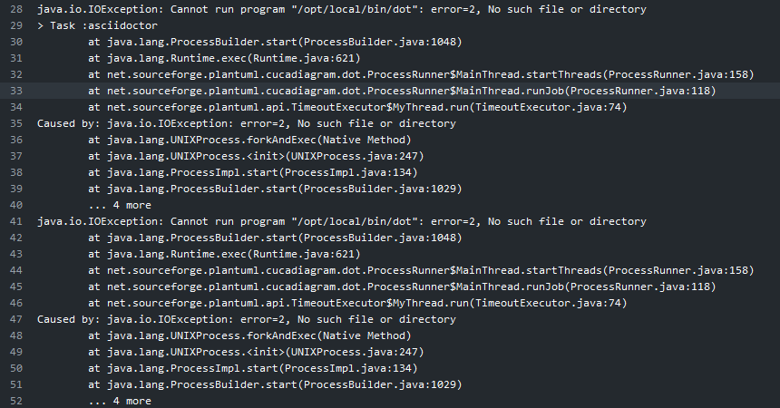

:source-highlighter: highlightjs
ifdef::include[]
:imagesdir: Ch02
else::include[]
endif::include[]

== 技術、インフラの選定

=== Asciidoc実装
==== Asciidoc実装一覧
[options="header", width="80%"]
.Asciidoc実装一覧
|====
|実装|言語|ビルドスクリプト
|Asciidoc(CRuby)|Ruby|rake
|AsciidotorJ|Java|maven, gradle
|Asciidoctor.js|Javascript|npm-scripts?
|Asciidoc(JRuby)|Ruby|rake
|Asciidoc(TruffleRuby)|Ruby|rake
|====
Asciidocは様々な環境で使用できますが、その実装の種類は大きく分けて2つに分類されます。

===== Ruby実装の置き換え
1つ目の実装種類はRuby実装を別言語ベースものに切り替えるものです。
この方法ではAsciidoc自体は本家CRubyのものをそのまま利用します。
エクステンションを適用する場合は
```Gem
gem install asciidoc-diagram
```
とRubyの流儀にしたがって適用します。
表ではAsciidoc(CRuby), Asciidoc(JRuby), Asciidoc(TruffleRuby)が対象になります。

===== Asciidoc(CRuby)の別実装
2つ目の実装種類はRuby以外の言語ベースにAsciidocのリファレンス実装をしたものです。
表ではAsciidoctorJ, Asciidocter.jsが対象になります。
言語ベースがRubyではないため、ビルドツールも各言語に合わせて変える必要があります。
エクステンションを適用する場合は例えばJava, Gradleの場合は
```Gradle
compile group: 'org.asciidoctor', name: 'asciidoctorj-diagram', version: '2.0.0'
```
と記述します。
javascriptのビルドツールについては私は詳しくないのでここではあまり詳しく記述しません（できません）。

==== Asciidoc実装選定時の考慮点
正直なところ細かい実装の違いについて語る知識、経験が私にはないので特に語れることはありません。
ただ、Asciidoc, AsciidoctorJ, Asciidoctor.jsでは利用できるエクステンションに差異があるため、必要な機能があるかよく確認したほうがいいと思います。
例えばAsciidocでPDF出力をしようと考える場合はAsciidoctorJ一択になったりします。

//TODO ==== 各実装ごとのエクステンション一覧

==== 本ドキュメントの実装
AsciidoctorJを利用します。単純に私が使い慣れているからという理由です。

=== ビルドスクリプト

=== Gitレポジトリ
- GitHub
- GitLab
- Azure repo
- AWS c

=== コンテナ
==== docker image
==== 環境構築
apt updateapt
graphbiz

=== CIツール
==== GitHub Actions & GitHub Pages
最初の候補としてまず上がると思われる方法です。GitHub Actions でドキュメントをビルドしてGitHub Pagesで公開します。
一番お手軽に実装できますがページは公開されるので、アクセス制限などは出来ません。

Actionsのテンプレートを見るとGradle Workflow という今回のプロジェクトにうってつけのものがありますが、試してみるとひとつ問題がありました。
asciidoc-diagram を利用したドキュメントをビルドしようとしたとき以下のような例外が発生します。

.GitHub ActionsでGradle Workflow を利用した例外


この例外の原因はJava CI のOSとして採用されているubuntu に graphviz というグラフ描画パッケージがインストールされていないことが原因です。
しかしながらGitHub Actions で提供されているホスティング環境では 新たにパッケージをインストールするようなカスタマイズが出来ないためGradle Workflow は利用できません。

したがって、Dockerfile を利用してビルド環境を自前で構成する必要があります。

.GitHubヘルプ（Dockerコンテナのアクションを作成する)
https://help.github.com/ja/actions/automating-your-workflow-with-github-actions/creating-a-docker-container-action

[source, dockerfile]
----
FROM adoptopenjdk:11.0.5_10-jre-hotspot


WORKDIR /asciidoc-environment

RUN ["/bin/bash", "-c", "apt update ;\
apt -y install graphviz ;\
locale-gen ja_JP.UTF-8 ;\
/usr/sbin/update-locale LANG=ja_JP.UTF-8 ;"]

ENV LC_ALL=ja_JP.UTF-8 LANG=ja_JP.UTF-8 LANGUAGE=""
----

[soucre,ruby]


